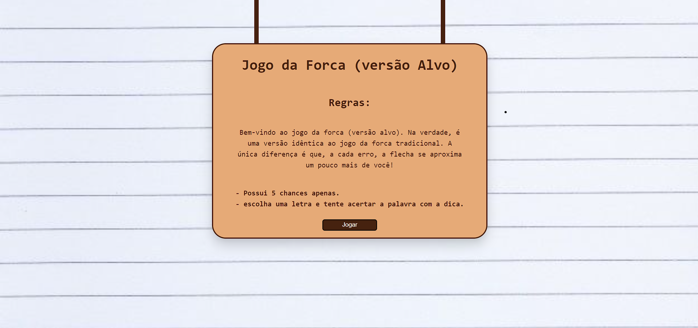
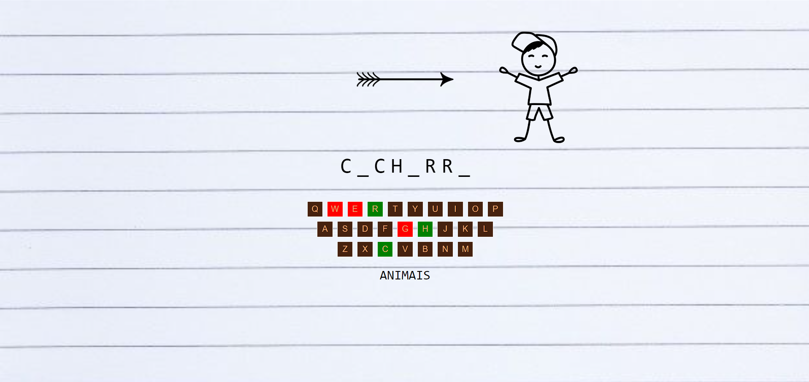

# jogo da forca (versão alvo)
Desenvolvimento de  um jogo utilizando JavaScript, CSS e HTML, onde foi explorado amplamente as funcionalidades do DOM e os eventos para criar uma experiência interativa.
O jogo apresenta uma abordagem criativa, oferecendo dicas para auxiliar os jogadores a acertarem as palavras,
além de contar com um menu de regras simples para orientar os usuários.
Estou bastante satisfeito com o resultado, principalmente pela velocidade que conseguir conduzir o projeto!

